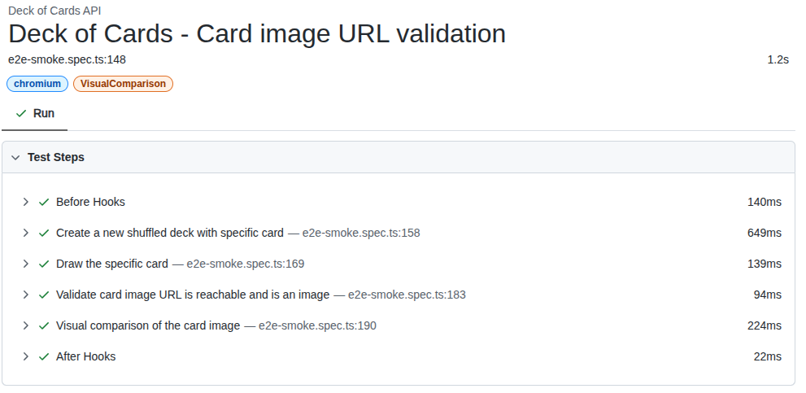

# 🃏 deck-of-cards-e2e-tests

End-to-end API tests for the Deck of Cards API using Playwright Test and TypeScript.

## Getting started 🚀

### Prerequisites ✅

- Node.js (LTS recommended). Install from https://nodejs.org/en/download

### IDE extensions 🧩

- [ESLint](https://marketplace.visualstudio.com/items?itemName=dbaeumer.vscode-eslint)
- [Prettier](https://marketplace.visualstudio.com/items?itemName=esbenp.prettier-vscode)
- [Playwright](https://marketplace.visualstudio.com/items?itemName=ms-playwright.playwright)

### Install dependencies 📦

Use the setup script to install npm dependencies and Playwright browsers:

```bash
npm run setup
```

## Project structure 📁

```
.
├── deck-e2e-tests/            # Main test directory containing all test-related files
│   ├── api-utils/             # Small helpers for API calls, interfaces and HTML/report snippets
│   │   ├── api-utils.ts
│   │   ├── data.ts
│   │   └── helper.ts
│   ├── assets/                # Test assets (images, files, etc.)
│   │   └── image.png
│   ├── deck-of-card/          # Domain-specific helpers for deck interactions
│   │   └── deck-of-card.ts
│   ├── tests/                 # Playwright test files
│   │   ├── e2e-smoke.spec.ts
│   │   └── e2e-smoke.spec.ts-snapshots/
│   │       └── ace-of-spades-chromium-linux.png
│   ├── playwright-report/     # Generated Playwright HTML report (after a run)
│   └── test-results/          # Generated test results and artifacts
├── playwright.config.ts       # Playwright configuration (testDir, reporter, devices, etc.)
├── eslint.config.js           # ESLint config
├── package.json               # Scripts and devDependencies
├── README.md
├── .env                       # Environment variables (loaded by Playwright config)
├── .env.example              # Example environment variables file
├── .gitignore                # Git ignore patterns
├── .prettierrc               # Prettier configuration
├── .prettierignore           # Prettier ignore patterns
├── .jscpd.json               # jscpd configuration for duplicate code detection
├── .husky/                   # Git hooks directory
├── .vscode/                  # VS Code workspace settings
├── .github/                  # GitHub workflows and templates
└── report/html/              # Generated jscpd HTML report (duplicate code)
```

Notes:

- `deck-e2e-tests/playwright-report/` and `deck-e2e-tests/test-results/` are generated after running tests.
- `report/html/` is generated by jscpd when you run the duplicate code check.
- The main test-related code is organized under `deck-e2e-tests/` for better project structure.

## Environment configuration 🔧

Playwright loads environment variables from `.env` at the project root.

Required variable:

- `DECK_BASE_URL` (defaults to https://deckofcardsapi.com if you use the provided `.env`).

Example `.env`:

```env
DECK_BASE_URL="https://deckofcardsapi.com"
```

## Running tests 🧪

Common ways to run tests with Playwright Test:

- Run all tests

  ```bash
  npx playwright test
  ```

- Run smoke tests

  ```bash
  npx playwright test --grep="@smoke"
  ```

- Headed mode (helpful when developing)

  ```bash
  npx playwright test --headed
  ```

- Open the UI mode

  ```bash
  npx playwright test --ui
  ```

- Update snapshots

  ```bash
  npx playwright test --update-snapshots
  ```

- Open the last HTML report
  ```bash
  npx playwright show-report
  ```

The config enables trace collection on first retry (`trace: on-first-retry`). If a retry happens, you can open the trace from the Playwright HTML report.

## Developer tooling 🛠️

- ESLint with TypeScript and Playwright rules
- Prettier for formatting
- jscpd for copy/paste detection

### Available npm scripts 🧰

- Lint: `npm run lint`
- Fix lint: `npm run lint:fix`
- Format: `npm run format`
- Check formatting: `npm run format:check`
- Duplicate code check: `npm run jscpd`
- Run precommit : `npm run lint:precommit`
- All checks: `npm run check`
- One-time setup (deps + browsers): `npm run setup`

## Reports 📊

- Playwright HTML: `playwright-report/` (open with `npx playwright show-report`)
- jscpd HTML: `report/html/`

## Troubleshooting 🩺

- If Playwright cannot find browsers, re-run:
  ```bash
  npx playwright install
  ```
- If environment variables are missing, ensure `.env` exists at the project root and values are correct.

## ⚠️ Warning: visual comparison for card images

Visual comparisons (snapshot tests) for card images may be flaky across different machines due to OS/hardware differences (fonts, graphics stack, scaling, anti-aliasing). Creating a Docker-based mechanism to standardize the runtime (used both in CI and locally) will be a future improvement to make these comparisons more reliable.



## Improvements (future work) 💡

- CI enhancements
  - Add a GitHub Actions workflow to run tests on PRs and main, upload artifacts (Playwright HTML report, traces, screenshots, jscpd report).
  - Use caching for npm to speed up runs; set `concurrency` to cancel outdated runs on the same branch.
  - Consider multi-reporter (e.g., `['html', 'github']`) to get inline annotations in PRs.
  - Matrix by browser (chromium, firefox, webkit) if needed; currently only chromium is enabled in `playwright.config.ts`.
  - Build a Docker image once and publish it to a container/artifact registry (e.g., GHCR); reuse it across jobs/matrix to speed up runs and ensure a consistent runtime (helps stabilize visual snapshots).

- Workflow inputs (manual dispatch)
  - Provide `workflow_dispatch` inputs to control runs from the UI, such as:
    - `base_url` (override DECK_BASE_URL)
    - `grep` (e.g., `@smoke`, `@visual`)
    - `browsers` (choice), `headed` (boolean), `update_snapshots` (boolean)

- Visual comparison stability
  - Create a consistent local run mechanism for image snapshot tests so users can record/update/verify snapshots in the same environment used by CI.
  - This will likely rely on a standardized runtime (future Docker-based mechanism) and an npm script alias (e.g., `npm run test:visual`) to drive it.

- Additional suggestions
  - Upload Playwright artifacts automatically on failures for easier debugging.
  - Introduce tags and conventions (`@smoke`, `@visual`, `@regression`) and document how to use `--grep` and `--grep-invert` effectively.
  - Add scheduled runs (e.g., nightly) against the public API to catch upstream changes.
  - Enforce commit conventions (Conventional Commits) and optionally add commit linting.
  - Auto-select base URL by environment (single variable): use one variable (e.g., `ENV=local|dev|qa|staging|prod`) and build `DECK_BASE_URL` at runtime in Playwright config via a small mapper or pattern (e.g., `https://$ENV.example.com`).
